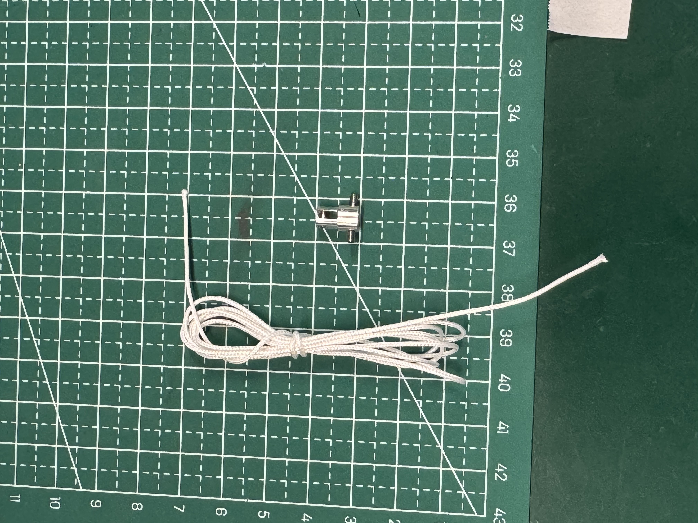
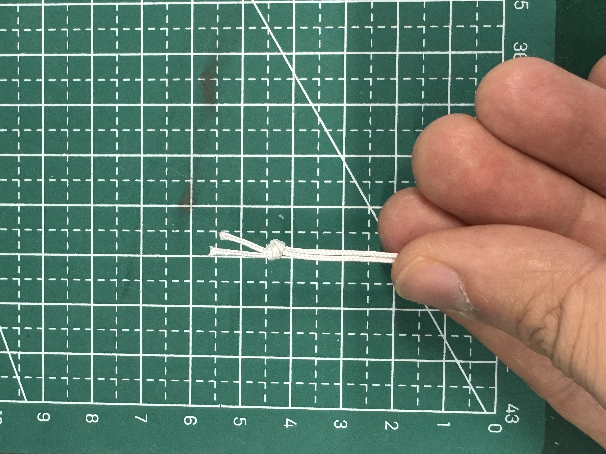
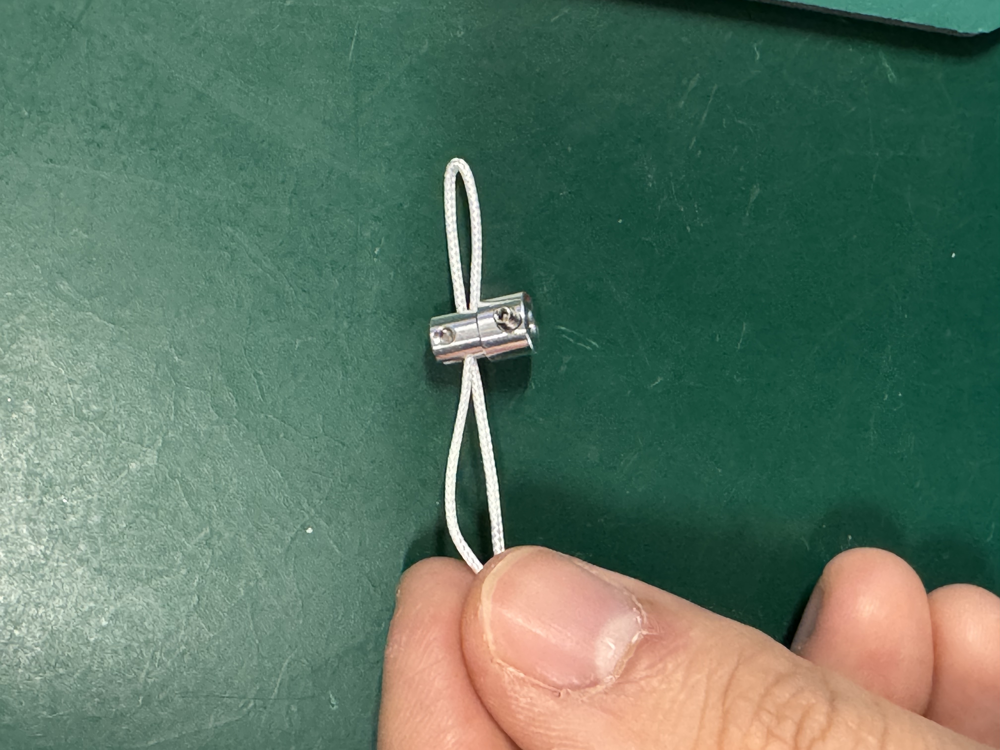
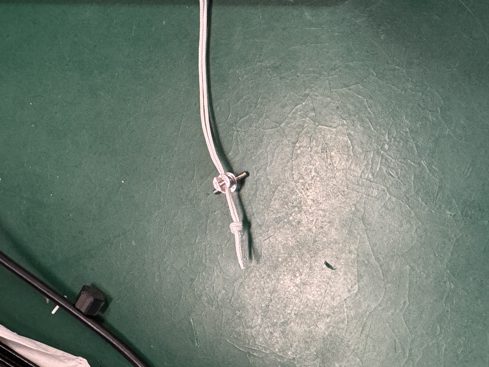
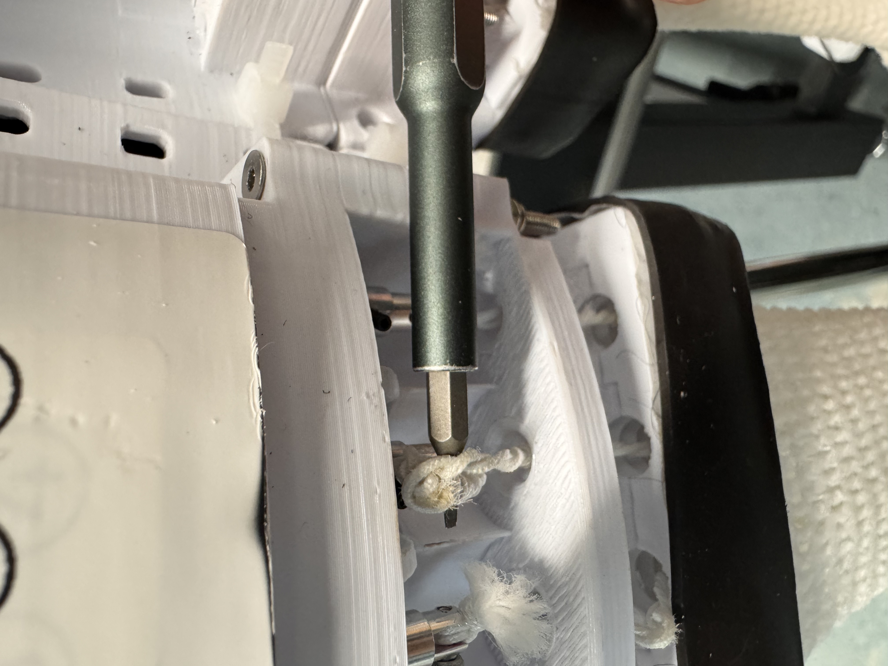
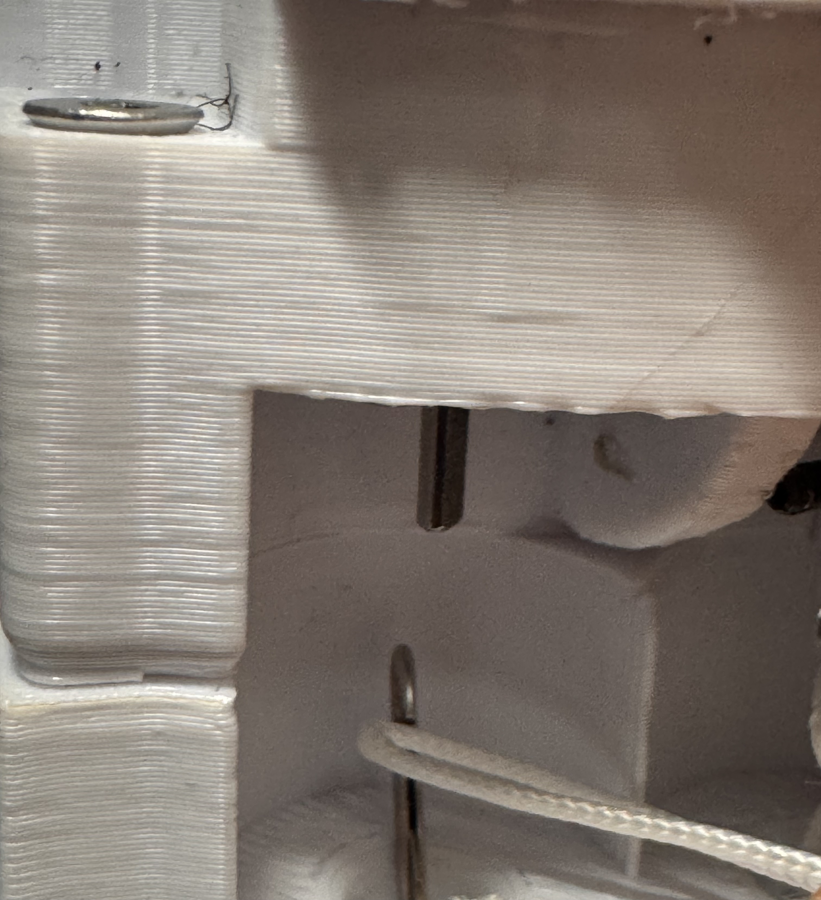

# HIP-ROBOT 说明 / HIP-ROBOT Instructions

---

## 穿戴方式 / Wearing Instructions

1. 背上包含硬件电路的背包并扣上卡扣。

   Put on the backpack containing the hardware circuit and fasten the buckle.

2. 将膝盖部固定装置穿戴好，确保两处绑带分别位于膝盖上下（图1）。

   Wear the knee fixation device, ensuring the two straps are positioned above and below the knee respectively (Figure 1).

3. 穿戴好IMU并将位置调整到腿前部（图2）。

   Wear the IMU and adjust its position to the front of the leg (Figure 2).

4. 另一侧腿也按照相同的步骤穿戴好（图3）。

   Repeat the same steps for the other leg (Figure 3).

5. 将IMU的连接线用腰带固定好，使其长短合适且不干扰腿部运动（图4）。

   Secure the IMU connection cables with the waist belt, ensuring proper length without interfering with leg movement (Figure 4).

### 行走演示 / Walking Demonstration

https://github.com/yiningzhang-hku/HIP-ROBOT-Instructions/raw/main/行走演示.mp4

---

## 维修建议及日常实验注意事项 / Maintenance Suggestions and Daily Experiment Precautions

### 用电说明 / Power Supply Instructions

黄色接头是供电线，黑色圆口接头是电池充电线。**在每次测试完毕之后，断开供电线，防止对电路板造成损害。**

The yellow connector is the power supply cable; the black round connector is the battery charging cable. **After each test, disconnect the power supply cable to prevent damage to the circuit board.**

---

### TSA连接转接头步骤 / TSA Connector Adapter Connection Steps

1. 取TSA-电机转接头、TSA线（图6），裁出70cm并对折（图7）、打结（图8）。

   Take the TSA-motor adapter and TSA cable (Figure 6), cut 70cm, fold in half (Figure 7), and tie a knot (Figure 8).

2. TSA双股线直接穿过TSA-电机转接头（图9），拉到打结处靠近转接头，之后根据视频演示完成打结（图10）。

   Thread the double-strand TSA cable through the TSA-motor adapter (Figure 9), pull until the knot is close to the adapter, then complete the knot per the video demonstration (Figure 10).

### TSA双股绳制作演示 / TSA Double-Strand Cable Making Demonstration

https://github.com/yiningzhang-hku/HIP-ROBOT-Instructions/raw/main/TSA双股绳制作演示.mp4

---

### TSA损坏更换步骤 / TSA Damage Replacement Steps

如若出现如图11的情况，可先鉴定是绳子被拉断还是其他情况；如果是绳子拉断，则需更换TSA绳。

If the situation shown in Figure 11 occurs, first determine whether the cable was pulled apart or if there is another issue; if the cable is broken, the TSA cable needs to be replaced.

**更换流程 / Replacement Procedure：**

1. 先将转接头上的绳子剪掉，用螺丝刀拧下顶丝（图12），取下转接头，取下断开的绳子。

   Cut off the cable on the adapter, use a screwdriver to unscrew the set screw (Figure 12), remove the adapter, and remove the broken cable.

2. 重新按照上面的步骤制作TSA双股绳并与连接头连接，用勾针从孔洞中捅到电机连接处（图13、14、15）。

   Remake the double-strand TSA cable following the steps above, connect it to the adapter, and use a crochet hook to push through the hole to the motor connection point (Figures 13, 14, 15).

3. 将TSA双股绳挂在勾针上（图16），然后拉出到底部（图17）。

   Hook the double-strand TSA cable onto the crochet hook (Figure 16), then pull it out to the bottom (Figure 17).

4. 使用镊子将转换头上的顶丝对准电机轴的凹陷处（图18），并连接电机轴（图19），然后拧紧顶丝，至此完成全部步骤。

   Use tweezers to align the set screw on the adapter with the indentation on the motor shaft (Figure 18), connect to the motor shaft (Figure 19), then tighten the set screw. This completes all steps.

### TSA更换演示 / TSA Replacement Demonstration

https://github.com/yiningzhang-hku/HIP-ROBOT-Instructions/raw/main/TSA更换演示.mp4
# HIP-ROBOT 说明 / HIP-ROBOT Instructions

---

## 穿戴方式 / Wearing Instructions

1. 背上包含硬件电路的背包并扣上卡扣。

   Put on the backpack containing the hardware circuit and fasten the buckle.

2. 将膝盖部固定装置穿戴好，确保两处绑带分别位于膝盖上下。

   Wear the knee fixation device, ensuring the two straps are positioned above and below the knee respectively.

3. 穿戴好IMU并将位置调整到腿前部。

   Wear the IMU and adjust its position to the front of the leg.

4. 另一侧腿也按照相同的步骤穿戴好。

   Repeat the same steps for the other leg.

5. 将IMU的连接线用腰带固定好，使其长短合适且不干扰腿部运动。

   Secure the IMU connection cables with the waist belt, ensuring proper length without interfering with leg movement.

### 行走演示 / Walking Demonstration

https://github.com/yiningzhang-hku/HIP-ROBOT-Instructions/raw/main/行走演示.mp4

---

## 维修建议及日常实验注意事项 / Maintenance Suggestions and Daily Experiment Precautions

### 用电说明 / Power Supply Instructions

黄色接头是供电线，黑色圆口接头是电池充电线。**在每次测试完毕之后，断开供电线，防止对电路板造成损害。**

The yellow connector is the power supply cable; the black round connector is the battery charging cable. **After each test, disconnect the power supply cable to prevent damage to the circuit board.**

---

### TSA连接转接头步骤 / TSA Connector Adapter Connection Steps

1. 取TSA-电机转接头、TSA线，裁出70cm并对折、打结。

   Take the TSA-motor adapter and TSA cable, cut 70cm, fold in half, and tie a knot.

2. TSA双股线直接穿过TSA-电机转接头，拉到打结处靠近转接头，之后根据视频演示完成打结。

   Thread the double-strand TSA cable through the TSA-motor adapter, pull until the knot is close to the adapter, then complete the knot per the video demonstration below.

### TSA双股绳制作演示 / TSA Double-Strand Cable Making Demonstration

https://github.com/yiningzhang-hku/HIP-ROBOT-Instructions/raw/main/TSA双股绳制作演示.mp4

---

### TSA损坏更换步骤 / TSA Damage Replacement Steps

如若出现绳子断裂的情况，可先鉴定是绳子被拉断还是其他情况；如果是绳子拉断，则需更换TSA绳。

If the cable breaks, first determine whether the cable was pulled apart or if there is another issue; if the cable is broken, the TSA cable needs to be replaced.

**更换流程 / Replacement Procedure：**

1. 先将转接头上的绳子剪掉，用螺丝刀拧下顶丝，取下转接头，取下断开的绳子。

   Cut off the cable on the adapter, use a screwdriver to unscrew the set screw, remove the adapter, and remove the broken cable.

2. 重新按照上面的步骤制作TSA双股绳并与连接头连接，用勾针从孔洞中捅到电机连接处。

   Remake the double-strand TSA cable following the steps above, connect it to the adapter, and use a crochet hook to push through the hole to the motor connection point.

3. 将TSA双股绳挂在勾针上，然后拉出到底部。

   Hook the double-strand TSA cable onto the crochet hook, then pull it out to the bottom.

4. 使用镊子将转换头上的顶丝对准电机轴的凹陷处，并连接电机轴，然后拧紧顶丝，至此完成全部步骤。

   Use tweezers to align the set screw on the adapter with the indentation on the motor shaft, connect to the motor shaft, then tighten the set screw. This completes all steps.

### TSA更换演示 / TSA Replacement Demonstration

https://github.com/yiningzhang-hku/HIP-ROBOT-Instructions/raw/main/TSA更换演示.mp4
