# HIP-ROBOT 说明 / HIP-ROBOT Instructions

> **文档版本 / Document Version**: v1.0  
> **适用对象 / Target Audience**: 设备操作人员 / Equipment Operators

---

## 目录 / Table of Contents

1. [穿戴方式 / Wearing Instructions](#穿戴方式--wearing-instructions)
2. [维修建议及日常实验注意事项 / Maintenance & Precautions](#维修建议及日常实验注意事项--maintenance--precautions)
   - [用电说明 / Power Supply Instructions](#用电说明--power-supply-instructions)
   - [TSA连接转接头步骤 / TSA Connector Adapter Steps](#tsa连接转接头步骤--tsa-connector-adapter-steps)
   - [TSA损坏更换步骤 / TSA Damage Replacement Steps](#tsa损坏更换步骤--tsa-damage-replacement-steps)

---

## 穿戴方式 / Wearing Instructions

| 步骤 / Step | 中文说明 | English |
|:---:|:---|:---|
| 1 | 背上包含硬件电路的背包并扣上卡扣 | Put on the backpack containing the hardware circuit and fasten the buckle. |
| 2 | 将膝盖部固定装置穿戴好，确保两处绑带分别位于膝盖上下（图一） | Wear the knee fixation device, ensuring the two straps are positioned above and below the knee respectively (Fig. 1). |
| 3 | 穿戴好IMU并将位置调整到腿前部（图二） | Wear the IMU and adjust its position to the front of the leg (Fig. 2). |
| 4 | 另一侧腿也按照相同的步骤穿戴好（图三） | Repeat the same steps for the other leg (Fig. 3). |
| 5 | 将IMU的连接线用腰带固定好，使其长短合适且不干扰腿部运动（图四） | Secure the IMU connection cables with the waist belt, ensuring proper length without interfering with leg movement (Fig. 4). |

 

<table>
<tr>
<td align="center"><strong>图一 / Figure 1</strong> 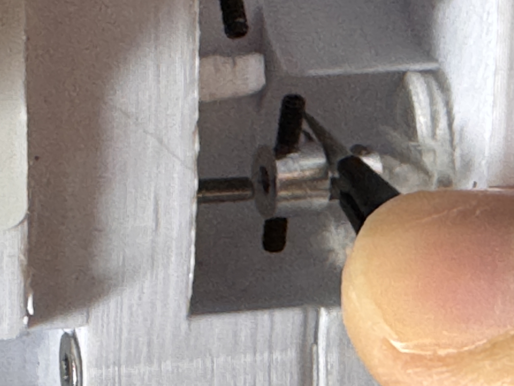</td>
<td align="center"><strong>图二 / Figure 2</strong> 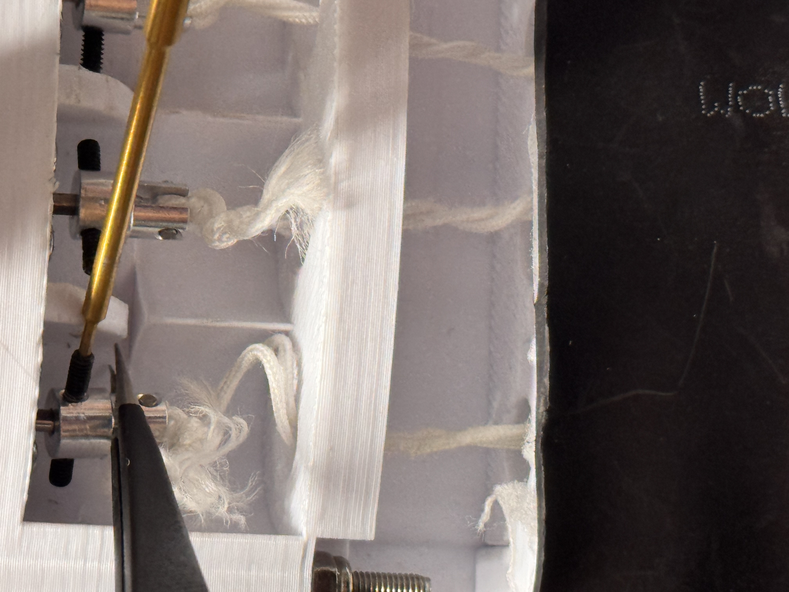</td>
</tr>
<tr>
<td align="center"><strong>图三 / Figure 3</strong> 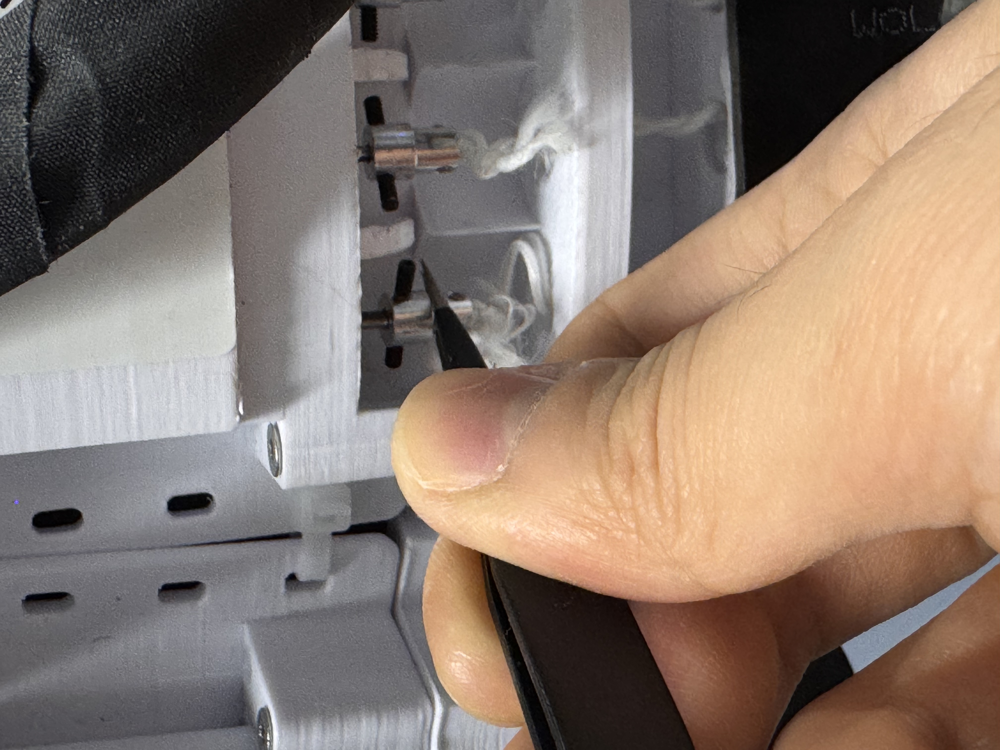</td>
<td align="center"><strong>图四 / Figure 4</strong> </td>
</tr>
</table>

 

> 🎬 **行走演示视频 / Walking Demonstration Video**

<video src="行走演示.mp4" width="600" controls>
  您的浏览器不支持视频播放 / Your browser does not support video playback.
</video>

---

## 维修建议及日常实验注意事项 / Maintenance & Precautions

### 用电说明 / Power Supply Instructions

> ⚠️ **注意 / WARNING**

| 中文 | English |
|:---|:---|
| 黄色接头是供电线，黑色圆口接头是电池充电线。 | The yellow connector is the power supply cable; the black round connector is the battery charging cable. |
| **在每次测试完毕之后，断开供电线，防止对电路板造成损害。** | **After each test, disconnect the power supply cable to prevent damage to the circuit board.** |

<table>
<tr>
<td align="center"><strong>图五 / Figure 5</strong> 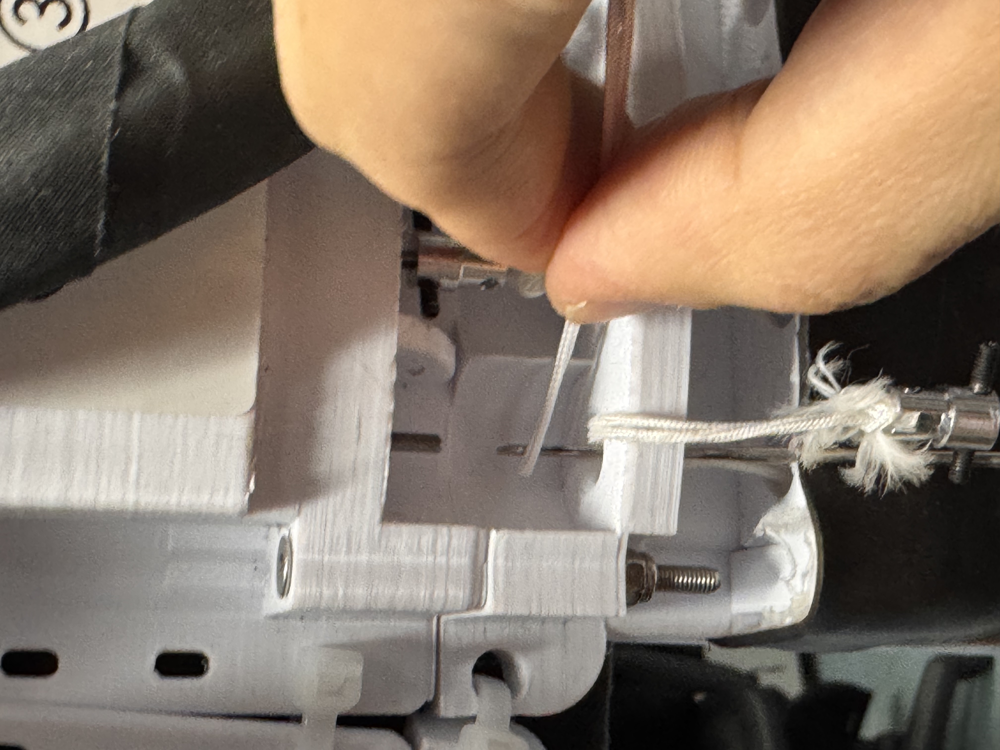</td>
</tr>
</table>

---

### TSA连接转接头步骤 / TSA Connector Adapter Steps

| 步骤 / Step | 中文说明 | English |
|:---:|:---|:---|
| 1 | 取TSA-电机转接头、TSA线（图六），裁出70cm并对折、打结（图七、图八） | Take the TSA-motor adapter and TSA cable (Fig. 6), cut 70cm, fold in half, and tie a knot (Fig. 7 & 8). |
| 2 | TSA双股线直接穿过TSA-电机转接头（图九），拉到打结处靠近转接头，之后根据视频演示完成打结（图十） | Thread the double-strand TSA cable through the TSA-motor adapter (Fig. 9), pull until the knot is close to the adapter, then complete the knot per the video demonstration (Fig. 10). |

 

<table>
<tr>
<td align="center"><strong>图六 / Figure 6</strong> </td>
<td align="center"><strong>图七 / Figure 7</strong> </td>
</tr>
<tr>
<td align="center"><strong>图八 / Figure 8</strong> </td>
<td align="center"><strong>图九 / Figure 9</strong> 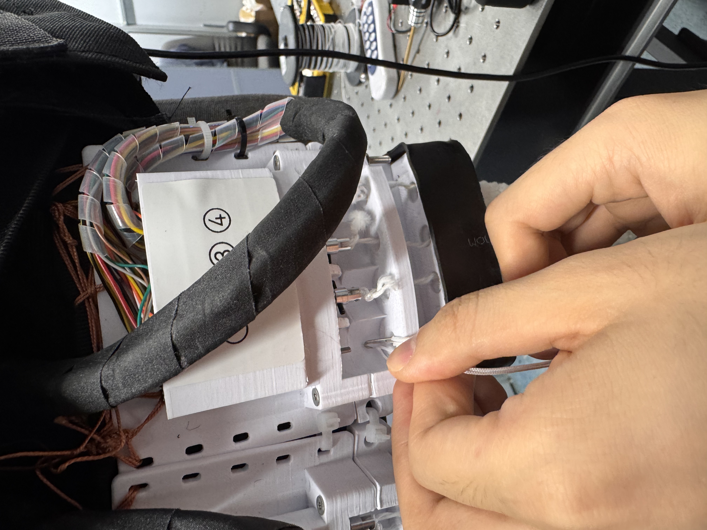</td>
</tr>
<tr>
<td align="center" colspan="2"><strong>图十 / Figure 10</strong> </td>
</tr>
</table>

 

> 🎬 **TSA双股绳制作演示视频 / TSA Double-Strand Cable Making Demonstration Video**

<video src="TSA双股绳制作演示.mp4" width="600" controls>
  您的浏览器不支持视频播放 / Your browser does not support video playback.
</video>

---

### TSA损坏更换步骤 / TSA Damage Replacement Steps

> ℹ️ **故障判断 / Fault Diagnosis**

| 中文 | English |
|:---|:---|
| 如若出现如图11的情况，可先鉴定是绳子被拉断还是其他情况；如果是绳子拉断，则需更换TSA绳。 | If the situation shown in Fig. 11 occurs, first determine whether the cable was pulled apart or if there is another issue; if the cable is broken, the TSA cable needs to be replaced. |

<table>
<tr>
<td align="center"><strong>图十一 / Figure 11</strong> 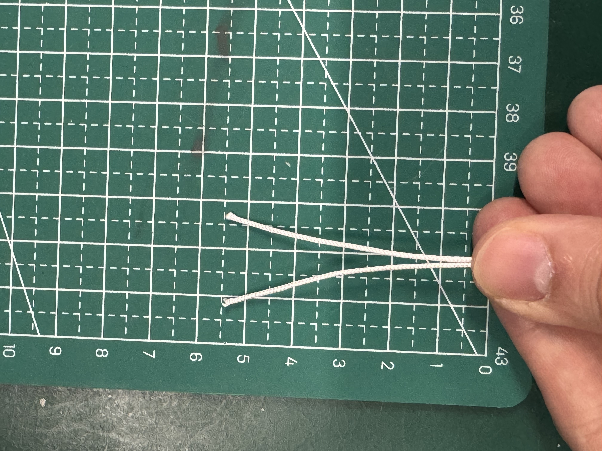</td>
</tr>
</table>

 

> 🔧 **更换流程 / Replacement Procedure**

> 🎬 **TSA更换演示视频 / TSA Replacement Demonstration Video**

<video src="TSA更换演示.mp4" width="600" controls>
  您的浏览器不支持视频播放 / Your browser does not support video playback.
</video>

 

**步骤一 / Step 1 — 拆卸旧绳 / Remove Old Cable**

| 中文 | English |
|:---|:---|
| 先将转接头上的绳子剪掉，用螺丝刀拧下顶丝（图12），取下转接头，取下断开的绳子。 | Cut off the cable on the adapter, use a screwdriver to unscrew the set screw (Fig. 12), remove the adapter, and remove the broken cable. |

**步骤二 / Step 2 — 重新制作并穿绳 / Remake & Thread Cable**

| 中文 | English |
|:---|:---|
| 重新按照上面的步骤制作TSA双股绳并与连接头连接，用勾针从孔洞中捅到电机连接处（图13、14、15）。 | Remake the double-strand TSA cable following the steps above, connect it to the adapter, and use a crochet hook to push through the hole to the motor connection point (Fig. 13, 14, 15). |

<table>
<tr>
<td align="center"><strong>图十二 / Figure 12</strong> </td>
<td align="center"><strong>图十三 / Figure 13</strong> </td>
</tr>
<tr>
<td align="center"><strong>图十四 / Figure 14</strong> 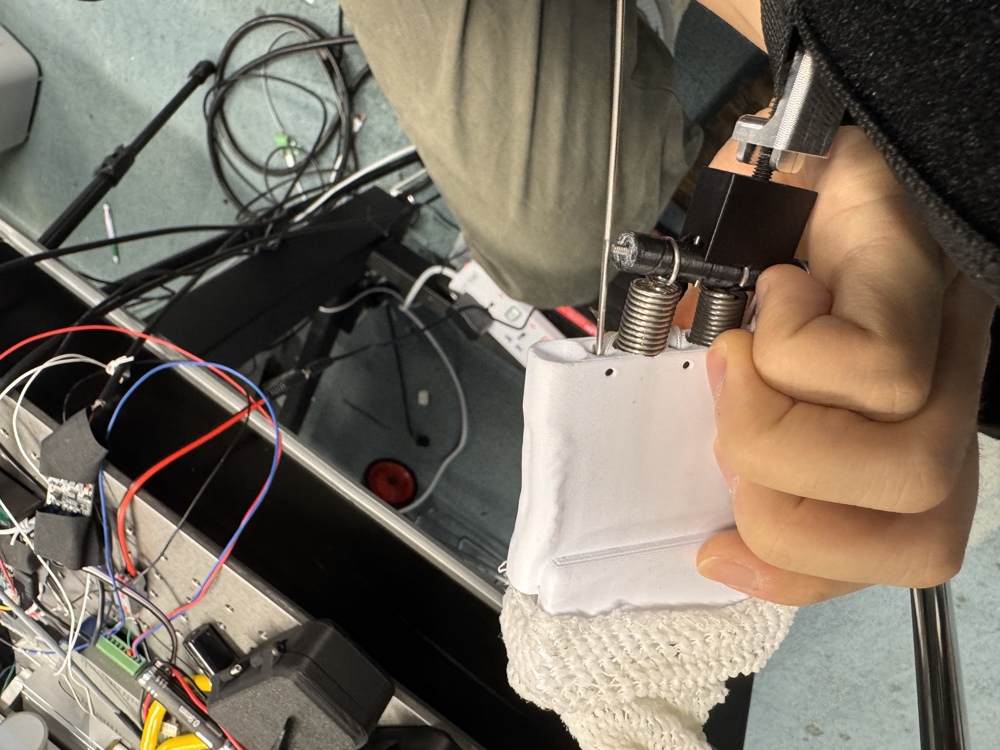</td>
<td align="center"><strong>图十五 / Figure 15</strong> 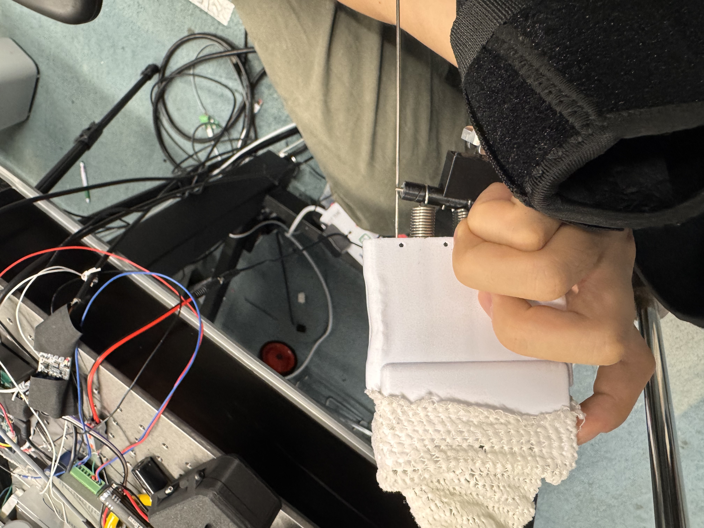</td>
</tr>
</table>

 

**步骤三 / Step 3 — 拉出绳索 / Pull Out Cable**

| 中文 | English |
|:---|:---|
| 将TSA双股绳挂在勾针上（图16），然后拉出到底部（图17）。 | Hook the double-strand TSA cable onto the crochet hook (Fig. 16), then pull it out to the bottom (Fig. 17). |

<table>
<tr>
<td align="center"><strong>图十六 / Figure 16</strong> 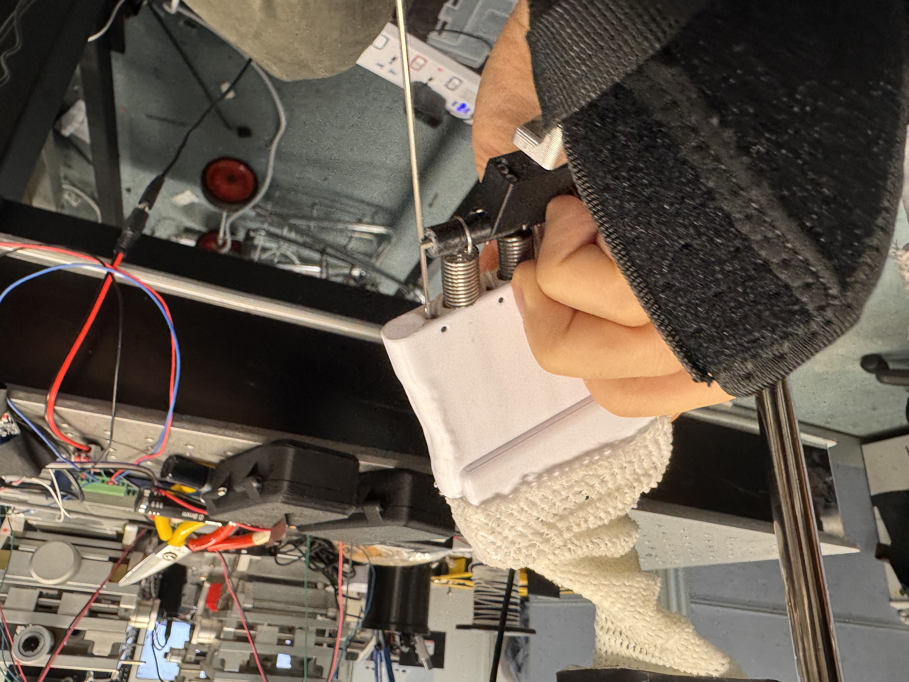</td>
<td align="center"><strong>图十七 / Figure 17</strong> 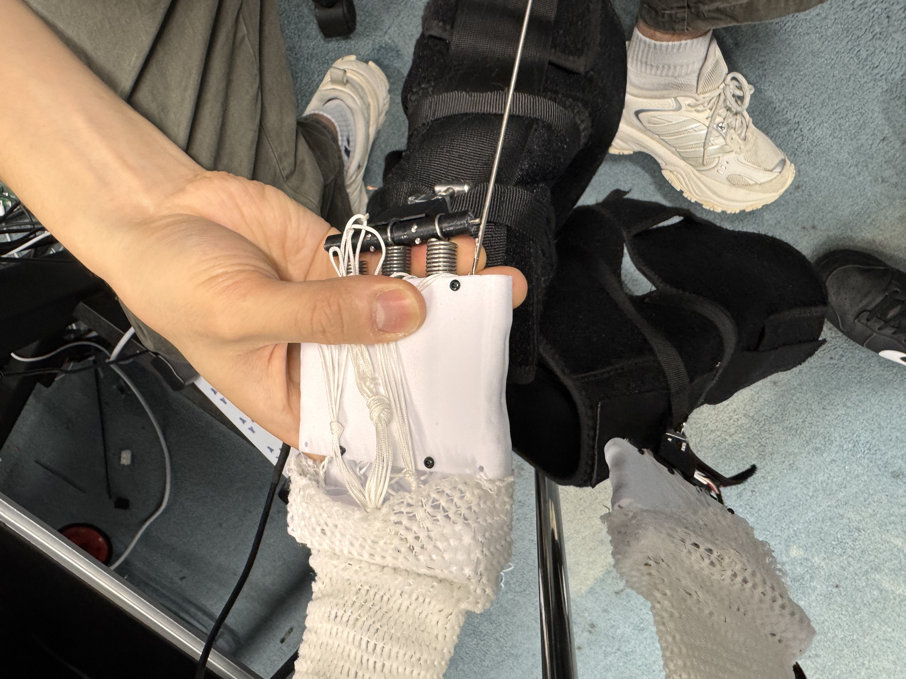</td>
</tr>
</table>

 

**步骤四 / Step 4 — 连接电机轴 / Connect Motor Shaft**

| 中文 | English |
|:---|:---|
| 使用镊子将转换头上的顶丝对准电机轴的凹陷处（图18），并连接电机轴（图19），然后按照图12的方式拧紧顶丝，至此完成全部步骤。 | Use tweezers to align the set screw on the adapter with the indentation on the motor shaft (Fig. 18), connect to the motor shaft (Fig. 19), then tighten the set screw as shown in Fig. 12. This completes all steps. |

<table>
<tr>
<td align="center"><strong>图十八 / Figure 18</strong> </td>
<td align="center"><strong>图十九 / Figure 19</strong> 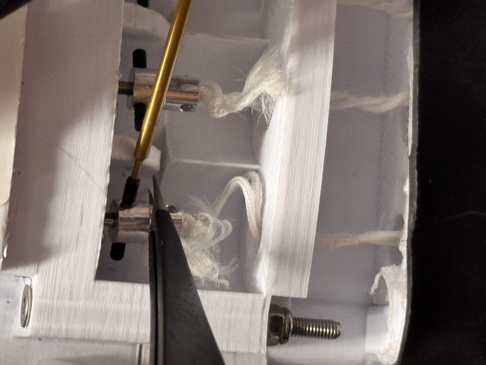</td>
</tr>
</table>

---

> ✅ **全部步骤完成 / All Steps Completed**
